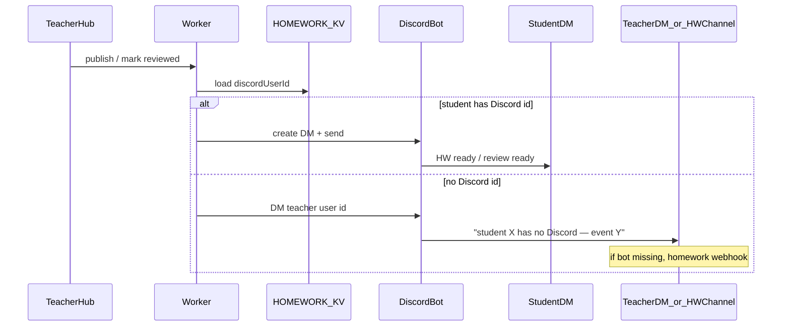

# Discord student notifications

## Goal (your words)

1. **Ping the student on Discord** when something relevant happens (new homework, review ready).
2. If they have **no Discord linked**, **ping you (JD)** instead so you know to reach them another way — prefer Discord DM to you; homework-channel webhook is OK as a backup.

## Why a bot (not another webhook)

Webhooks already post to channels (`DISCORD_WEBHOOK_URL`, `DISCORD_HOMEWORK_WEBHOOK_URL`). They **cannot DM students**.

Platform doc already says this: student DMs need a **Discord Bot** + mapped Discord user IDs ([`docs/NIHONGO-WEEKLY-PLATFORM.md`](docs/NIHONGO-WEEKLY-PLATFORM.md) Phase 4). Store IDs in **KV student profile** (not D1 yet — we don’t have D1 wired for this).

## Events (v1 — only these two)

| When | Student message (sketch) | Fallback to JD |
|------|--------------------------|----------------|
| After successful `POST /api/homework-publish` | New homework ready + hub link (+ lesson link if set) | “Published HW for {student} but no Discord linked” |
| After `POST /api/homework-review` when status becomes **reviewed** | Review ready — open Homework Hub | “Review ready for {student} but no Discord linked” |

Out of scope for v1: submit pings (already go to #hw channel), ack pings, notebook, birthdays, browser push.

## 1. Student Discord ID on profile

**Storage:** extend account-settings blob already used by `saveStudentProfile` / `getStudentProfileForTeacher` in [`src/homework-kv.ts`](src/homework-kv.ts) — add optional `discordUserId` (snowflake string, digits only).

**API:** include in `StudentProfilePayload` / `StudentProfileView`; GET/POST [`/api/homework-student-profile`](src/index.ts).

**UI:** Student info tab in [`public/homework/platform.html`](public/homework/platform.html) + [`public/js/hw-teacher-editor.js`](public/js/hw-teacher-editor.js):

- Label: **Discord user ID**
- Short hint: Developer Mode → right-click their Discord profile → Copy User ID
- Optional later: paste `username` lookup — not v1

No change to student-facing hub UI.

## 2. Worker notify helper — `src/discord-notify.ts`

Env (new secrets / vars):

| Name | Purpose |
|------|---------|
| `DISCORD_BOT_TOKEN` | Bot token (secret) |
| `DISCORD_TEACHER_USER_ID` | JD’s Discord snowflake for fallback DMs |

Behavior:

1. `dmDiscordUser(userId, content)` — `POST /users/@me/channels` then `POST /channels/{id}/messages` (standard Discord REST).
2. `notifyStudentWithTeacherFallback({ studentUsername, discordUserId, studentContent, teacherContent })`:
   - If `discordUserId` present → DM student; on hard failure (user closed DMs, etc.) → also notify teacher with reason.
   - If missing → DM teacher (or homework webhook if no bot / no teacher id).
3. Never fail the publish/review HTTP response because Discord failed — log + best-effort; return `discordNotify: { ok, mode }` optionally for teacher UI toast later.

Reuse existing webhook helpers in [`src/index.ts`](src/index.ts) only for the **fallback channel post** path.

## 3. Hook points

1. **[`handleHomeworkPublish`](src/index.ts)** — after `publishToStudentHub` succeeds, load profile `discordUserId`, call notify (async, don’t block response longer than needed; `waitUntil` if available on `ExecutionContext`, else fire-and-log).
2. **[`handleHomeworkReview`](src/index.ts)** — after `saveHomeworkReview`, only if `reviewStatus === "reviewed"` (and ideally only when newly reviewed, not every note save — check previous status or `markReviewed` flag on body).

Message content: plain text, short, include absolute hub URL (`origin + /homework/platform.html` or student assignment URL from publish result).

## 4. Discord setup (you / JD — once)

1. Create app at Discord Developer Portal → Bot → Enable **Message Content** only if needed (DMs we send don’t need it); copy token → `wrangler secret put DISCORD_BOT_TOKEN`.
2. Invite bot to the JLM server with permission to… actually for **user DMs**, bot does **not** need channel perms; students must allow DMs from server members **or** have an open DM path with the bot. Practical rule: students in the server + “Allow DMs from server members” ON.
3. Copy your Discord user ID → `wrangler secret put DISCORD_TEACHER_USER_ID` (or `[vars]` if non-secret).
4. In Teacher Hub → Student info → paste each student’s Discord user ID when known.

## 5. Docs + deploy

- Short section in [`docs/DEPLOY.md`](docs/DEPLOY.md) or ARCHITECTURE Discord table: bot secrets + Student info field.
- Update Phase 4 note: IDs live in KV profile, not D1 yet.
- Deploy after code lands; **secrets must be set in Cloudflare or DMs no-op to webhook fallback**.

## Smoke check

1. Student with Discord ID → publish HW → student gets DM; review marked reviewed → student gets DM.
2. Student without ID → same actions → JD gets DM (or #hw webhook line) mentioning the student.
3. Publish/review still succeed if Discord API is down.
4. Invalid / non-digit Discord ID rejected or ignored at save time (don’t store junk).

## Parallelizable once plan approved

- Track A: profile field + UI (KV + teacher editor)
- Track B: `discord-notify.ts` + Env types
- Track C: wire publish + review hooks + docs

Merge order: A+B first, then C, then secrets + deploy.
