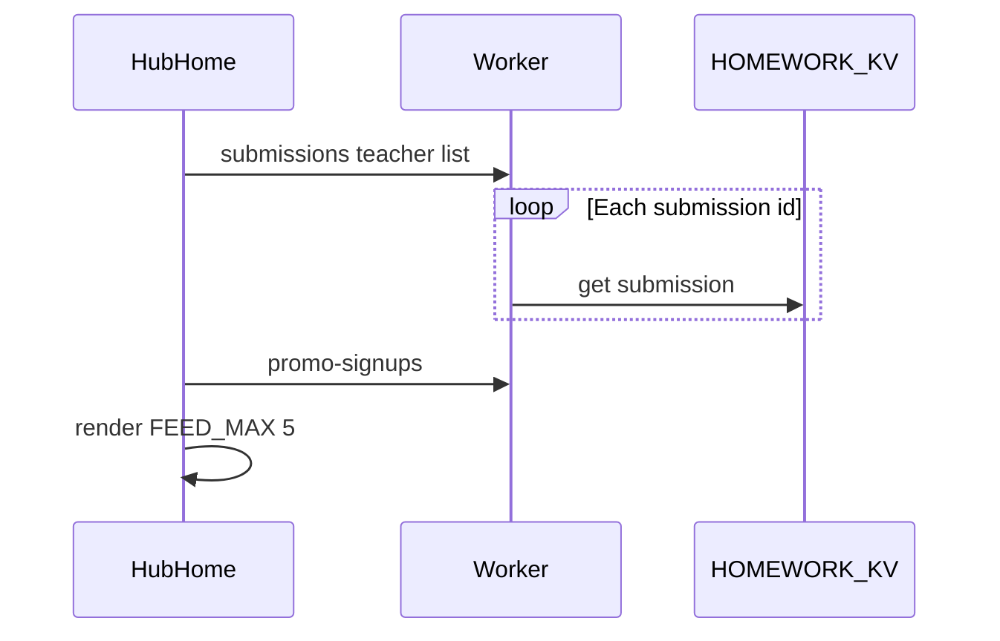

# Fix slow Teacher Hub notifications

## Why it feels stuck on “Loading…”

Home feed in `[public/js/hw-hub-v6.js](public/js/hw-hub-v6.js)` calls `buildNotifications()`, which:

1. **Awaits all submissions** via `GET /api/homework-submissions?teacherUsername=…`
2. **Then** awaits promo signups (sequential, not parallel)

On the server, `[listHomeworkSubmissions](src/homework-kv.ts)` reads the submissions index, then does **one `kv.get` per id in a `for` loop** — classic N+1. Newer ids are at the front of the index (`unshift` on write), but the feed still loads **every** submission before showing 5 items.

Birthday ticker runs separately (`void refreshBirthdayTicker`) and is not the main blocker.

## Approach (concrete)

### 1. Server: faster teacher list — `[src/homework-kv.ts](src/homework-kv.ts)` + `[src/index.ts](src/index.ts)`

- Change `listHomeworkSubmissions` to fetch KV entries in **parallel batches** (e.g. chunks of 25 `Promise.all`) instead of sequential awaits. Helps Submissions tab and Home.
- Add optional `limit` (and keep existing `student` filter): when `limit` is set, only take the first N ids from the newest-first index before fetching. Wire through `handleHomeworkSubmissions` as `?limit=40` (or similar).
- Notifications only need recent rows for “submitted / ack” cards — client will request a capped list.

### 2. Client: snappier Home feed — `[public/js/hw-hub-v6.js](public/js/hw-hub-v6.js)`

- In `buildNotifications`: `Promise.all` submissions + promo (stop serial wait).
- Call submissions with `limit` (e.g. 40) so Home never pulls the full archive.
- **Paint first**: on `refreshNotifications`, immediately show local demo/skeleton items (or empty feed chrome), then replace when network returns — avoid a long blank “Loading…” stare.
- Fix demo merge gate: demos currently merge when `hubV6()` is true (always on in prod). Restrict demos to **local/dev** only so production feed is real data only.

### 3. Deploy

Worker + JS behavior change → `npm run deploy` after the fix. Hard-refresh Teacher Hub Home.

## Out of scope

- Visual Toolbar playtest (separate plan; pause until this lands)
- Redesigning notification cards
- Full submissions pagination UI (only cap for the Home feed path)

## Smoke check

1. Teacher login → Home feed appears quickly (under ~1–2s typical, not “stuck loading”)
2. Real submissions/acks still show when present
3. Submissions panel under Students still lists work (batching must not drop rows when no `limit`)
4. Promo cards still appear when signups exist
5. Local still can show demos; production does not mix demos into the feed

